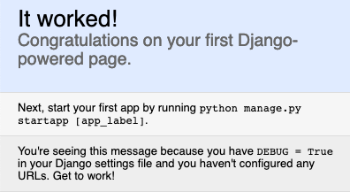

# GDash

G-Dash (Genome Dashboard) is a web-based prototype of a genomics dashboard, specifically designed to integrate informatics and 4D material studies of chromatin. G-Dash unites our Interactive Chromatin Modeling (ICM) tools with the Biodalliance genome browser and the JSMol molecular viewer to rapidly fold any DNA sequence into atomic or coarse-grained models of DNA, nucleosomes or chromatin.

## Installation

1. Clone the repo: `git clone git@bitbucket.org:genomedashboard/genome-dashboard-webapp.git`
2. Install conda (see `genome-dashboard-webapp/venv/conda_usage.md`).
3. Navigate into the gdash codebase venv folder: `cd genome-dashboard-webapp/venv`
4. Create the virtual environment with conda using the environments.yml file: `conda env create -f environment.yml`
5. Navigate into the django project root folder `cd ../gdash`
6. Start the django project `python manage.py runserver`
7. Open a browser and navigate to the portal at URL `localhost:8000`

At this point you should see a simple text message like the following:

## Usage

### Local Development

At this point you can begin to do development on the codebase locally. Please see the document located under `genome-dashboard-webapp/documentation/git_usage.md` for details on recommended workflows and best practices.

### Deployment

Additional documentation will be forthcoming detailing deployment procedures for the gdash gateway.

## Contributing

Pull requests are welcome.
For major changes, please open an issue first to discuss what you would like to change.
Please make sure to update tests as appropriate.

## License

[Choose a license](https://choosealicense.com/)
